<div align="center">
  <h1>🎲 DiceBox 📦</h1>
</div>

> [!NOTE]
> Um sistema de e-commerce e gerenciamento focado em jogos de tabuleiro, cartas e mídias físicas. O projeto conecta clientes a vendedores de forma escalável e resiliente, utilizando uma arquitetura distribuída moderna com microsserviços.

---

## 🚧 Status do Projeto

[](#)      

---

## 📚 Índice
- [Sobre o Projeto](#-sobre-o-projeto)
- [Funcionalidades Principais](#-funcionalidades-principais)
- [Tecnologias Utilizadas](#-tecnologias-utilizadas)
- [Arquitetura e Diagramas](#-arquitetura-e-diagramas)
  - [Modelos de Sistema e Domínio](#modelos-de-sistema-e-domínio)
  - [Diagramas de Sequência](#diagramas-de-sequência)
- [Instalação e Execução](#-instalação-e-execução)
- [Modelagem de Dados](#-modelagem-de-dados)
- [Autores](#-autores)

---

## 📝 Sobre o Projeto
O **DiceBox** é um sistema desenvolvido como parte da disciplina de Projeto de Software. O propósito central da aplicação é fornecer uma plataforma robusta onde clientes possam explorar um catálogo diversificado de jogos (tabuleiros, cartas e CDs) e vendedores possam gerenciar suas vendas e estoques de maneira eficiente.

O sistema foi arquitetado visando **escalabilidade e alta disponibilidade**. Para suportar picos de vendas e garantir que falhas em serviços externos (como APIs de pagamento) não derrubem a aplicação, adotou-se uma infraestrutura baseada em contêineres e comunicação assíncrona.

---

## ✨ Funcionalidades Principais

As operações do sistema foram mapeadas em casos de uso direcionados a dois atores principais:

### 🛒 Fluxo do Cliente
- **Gestão e Navegação:** O cliente pode gerenciar sua conta, navegar pelo catálogo de jogos e visualizar detalhes específicos dos produtos.
- **Compras:** O sistema permite gerenciar o carrinho de compras, fechar pedidos e realizar pagamentos processados via API externa.
- **Pós-venda:** É possível acompanhar o status do pedido de forma atualizada e, após o recebimento, avaliar a compra.

### 📦 Fluxo do Vendedor
- **Catálogo e Estoque:** O vendedor pode cadastrar novos produtos à venda e controlar rigidamente as quantidades em estoque.
- **Gestão de Pedidos:** Acompanhamento de pedidos pendentes, execução das rotinas de envio (informando o código de rastreio) e notificação automática de status para o cliente.

---

## 🛠 Tecnologias Utilizadas

A base tecnológica do DiceBox foi selecionada para sustentar uma operação distribuída de alto desempenho na nuvem.

### 🖥️ Back-end & Infraestrutura
* **Linguagem:** Java.
* **Frameworks:** Micronaut ou Spring Boot (visando inicialização rápida de microsserviços).
* **Banco de Dados Relacional:** PostgreSQL, com instâncias dedicadas para cada microsserviço.
* **Mapeamento Objeto-Relacional (ORM):** JPA/Hibernate.
* **Mensageria:** RabbitMQ (via Amazon MQ) para filas de comunicação assíncrona.
* **Infraestrutura e Deploy:** Contêineres Docker hospedados em um cluster na Nuvem AWS (ECS/EKS e Amazon RDS).
* **Notificações:** Integração com Amazon SNS para disparos de mensagens via PUSH e SMS.

---

## 🏗 Arquitetura e Diagramas

O sistema adota os seguintes padrões arquiteturais e de projeto:
- **Microsserviços Isolados:** A plataforma foi desmembrada em serviços independentes de *Catálogo e Inventário*, *Pedidos*, *Pagamento* e *Notificação*. 
- **Comunicação Assíncrona e Event-Driven:** O acoplamento entre os serviços é minimizado pelo uso do RabbitMQ. 
- **Arquitetura Hexagonal (Ports and Adapters):** O núcleo de regras de negócios está completamente isolado de tecnologias externas.
- **Design Pattern Facade:** Utilizado primariamente na finalização de compras, simplificando as chamadas para o cliente.

Abaixo estão as representações visuais da arquitetura e fluxos do sistema:

### Modelos de Sistema e Domínio

| Casos de Uso | Diagrama de Classes |
| :---: | :---: |
| 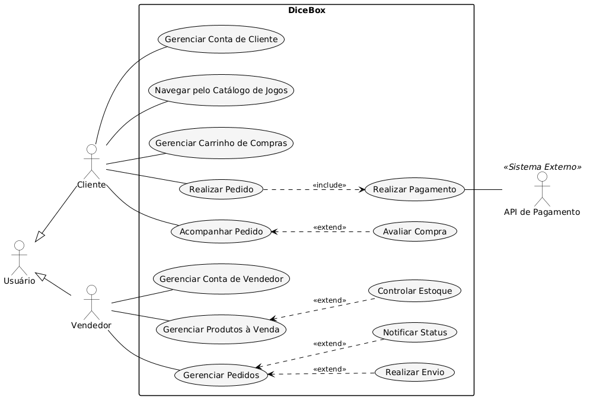 | 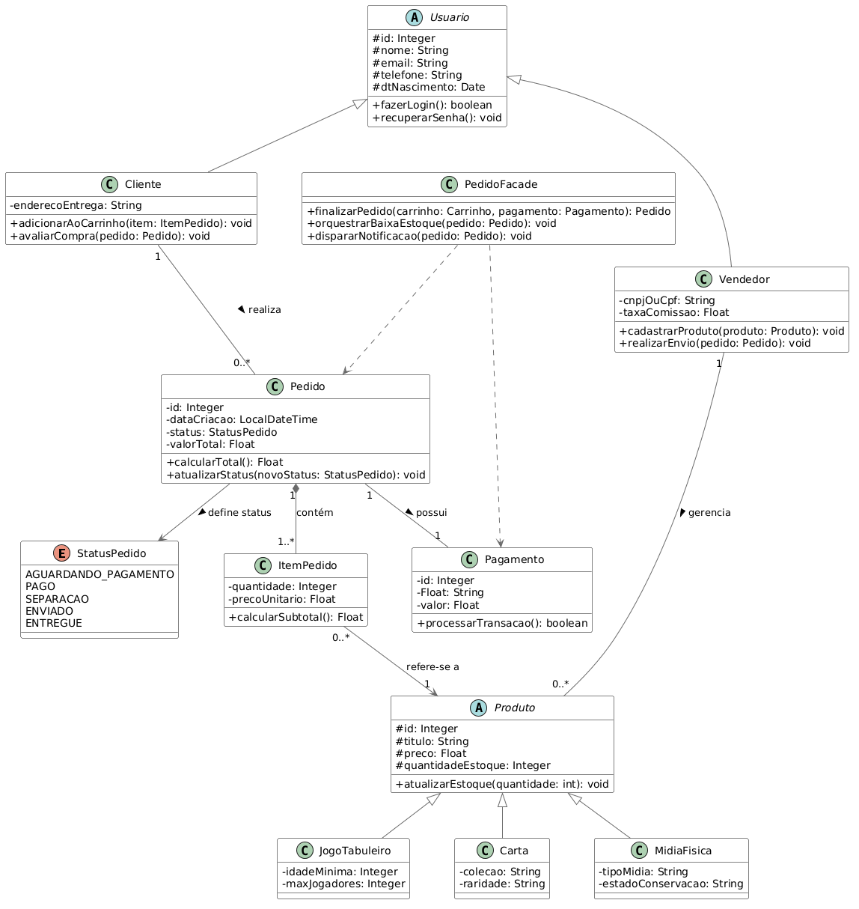 |

| Componentes | Implantação |
| :---: | :---: |
| 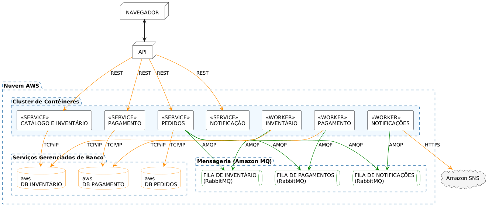 | 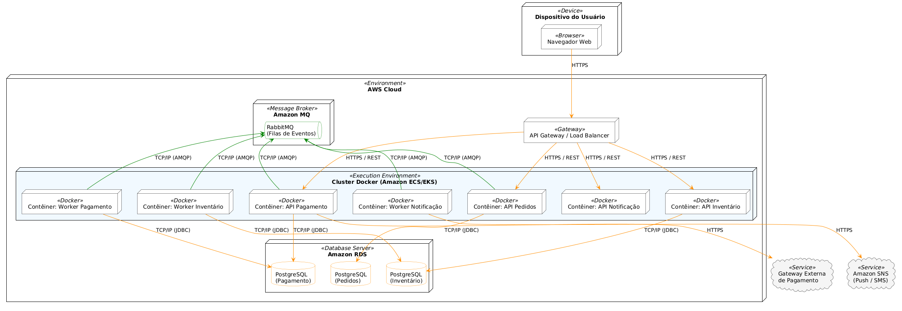 |

| Entidade-Relacionamento (DER) | Máquina de Estados |
| :---: | :---: |
| 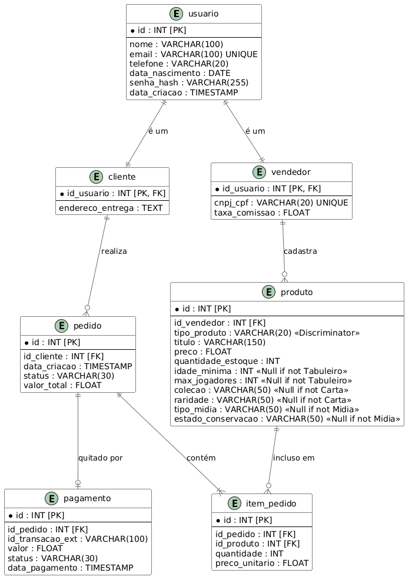 | 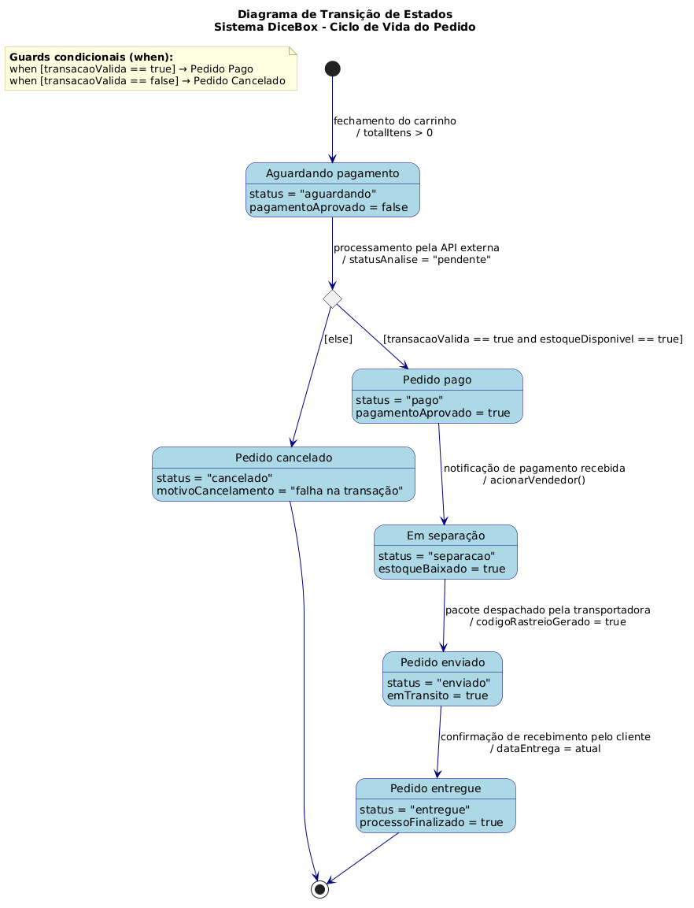 |

| Comunicação |
| :---: |
| 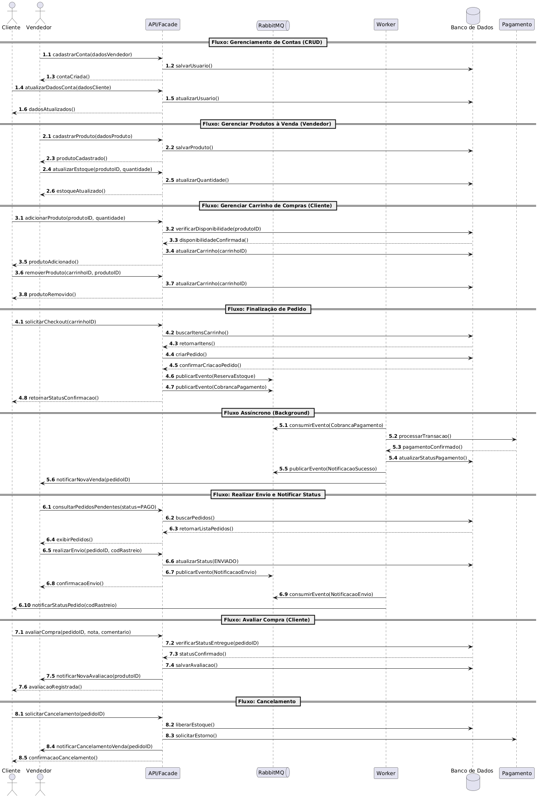 |

### Diagramas de Sequência

Abaixo estão detalhados os fluxos de interação e sequência das operações principais:

| Sequência Geral | Gestão de Usuário |
| :---: | :---: |
| 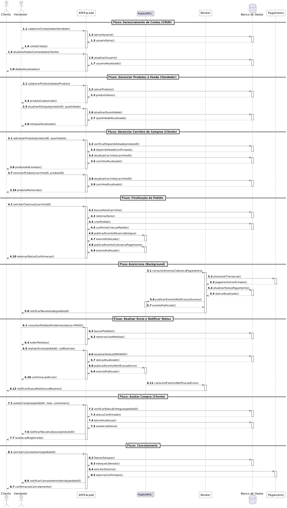 | 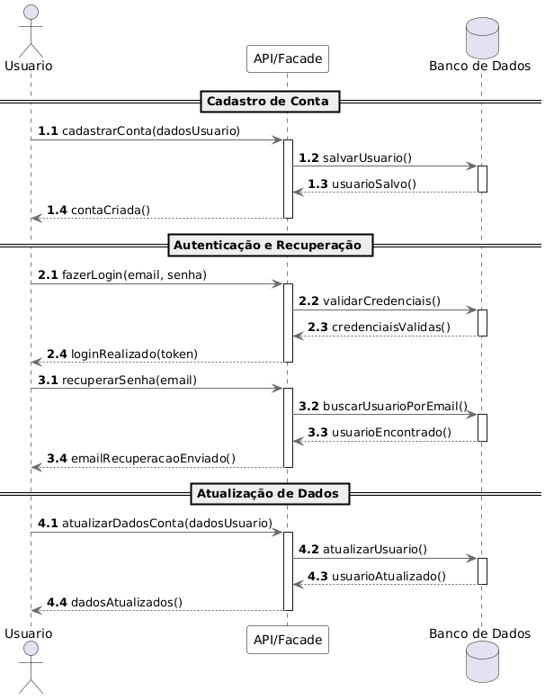 |

| Catálogo e Compra | Carrinho de Compras |
| :---: | :---: |
| 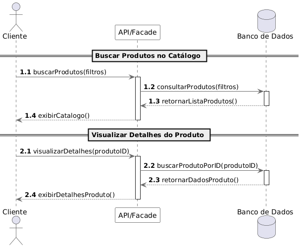 | 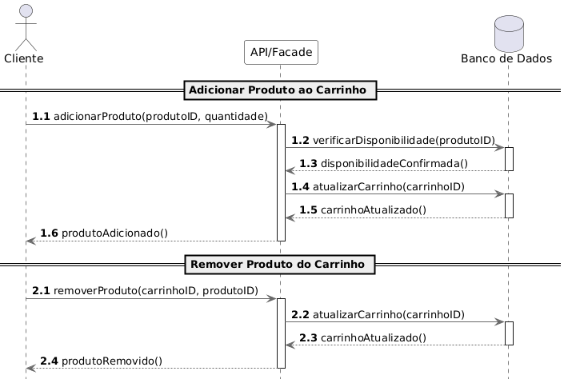 |

| Realizar Pedido | Acompanhar Pedido |
| :---: | :---: |
| 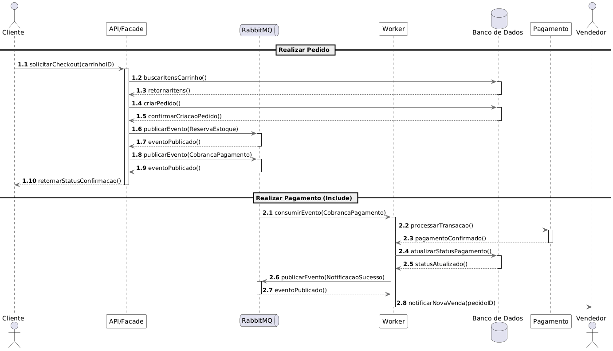 | 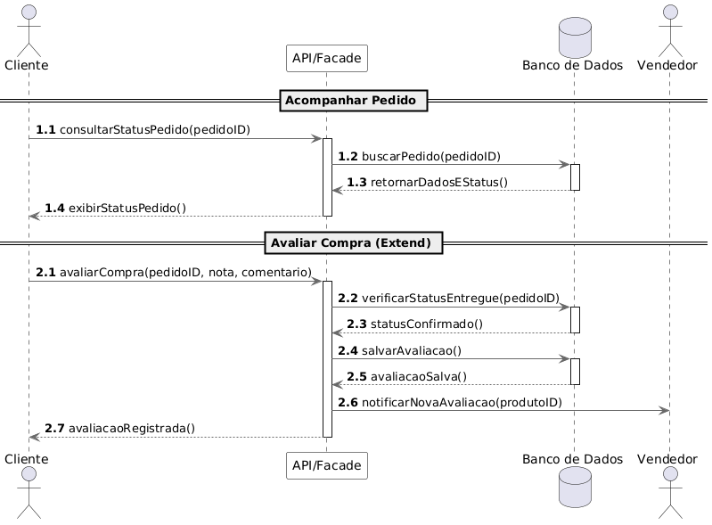 |

| Gerenciar Estoque | Gerenciar Pedido (Vendedor) |
| :---: | :---: |
| 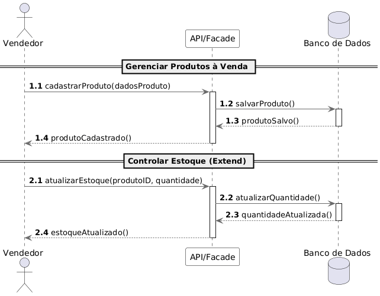 | 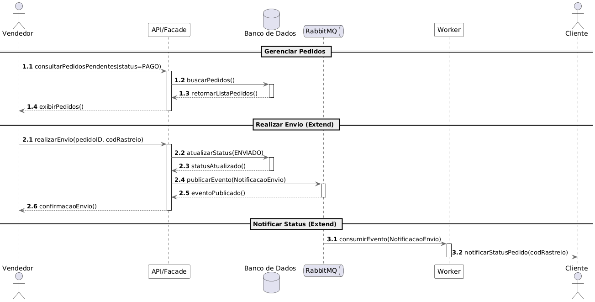 |

---

## 🔧 Instalação e Execução

### Pré-requisitos
* **Java JDK 17+**
* **Docker e Docker Compose** (Para rodar o PostgreSQL e o RabbitMQ localmente)
* **Maven ou Gradle** (Dependendo do framework escolhido)

### Execução via Docker Compose
Na raiz do projeto, suba a infraestrutura de bancos de dados e mensageria:

```bash
docker-compose up -d
